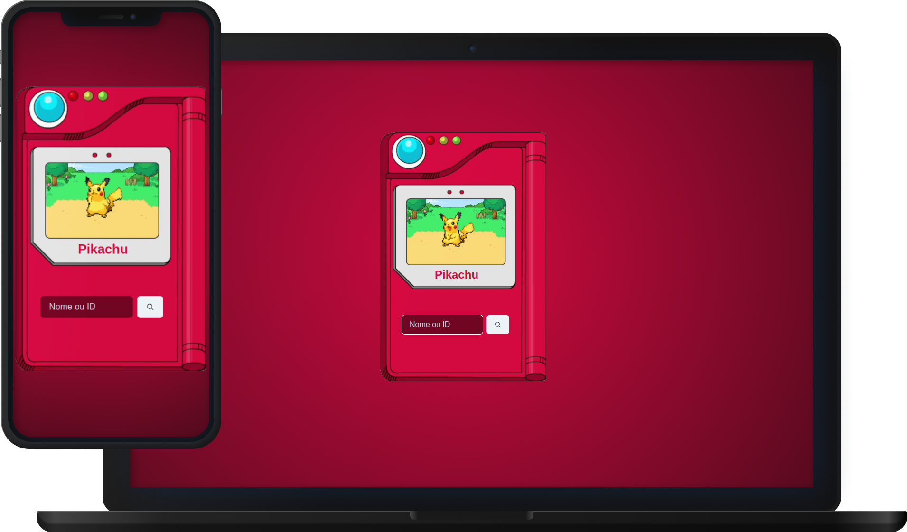

<p align="center">
   
</p>

<h1 align="center">Pokédex</h1>

<h3 align="center">
  :rocket: Aplicação feita para requisitar pokémons de uma API e renderizá-los em tela. 🚀
</h3>


# :computer: Tecnologias

Este projeto foi feito utilizando as seguintes tecnologias:

* [ReactJS](https://reactjs.org/)
* [Typescript](https://www.typescriptlang.org/)
* [Styled Components](https://styled-components.com/)
* [ChakraUI](https://chakra-ui.com/)
* [ViteJS](https://vitejs.dev/)
* [Axios](https://axios-http.com/ptbr/docs/intro)


## Como Iniciar?

### Requisitos

- [Yarn](https://classic.yarnpkg.com/) ou [npm](https://www.npmjs.com/package/npm)

**Clone o projeto e acesse a pasta**

```bash
git clone https://github.com/DiogoAMV/pokedex.git && cd pokedex
```

**Siga os passos abaixo**

### WEB

```bash
# Acesse a pasta 'pokedex'
$ cd pokedex
# Instale as dependências
$ npm install
# Inicie a aplicação
$ npm run dev
# O projeto iniciará no endereço http://localhost:5173/
```

---

Feito com :purple_heart: by [Diogo Marques](https://github.com/DiogoAMV)

[](https://www.linkedin.com/in/diogo-marques-719950221/) 
[](mailto:contato.diogoamv@gmail.com)
